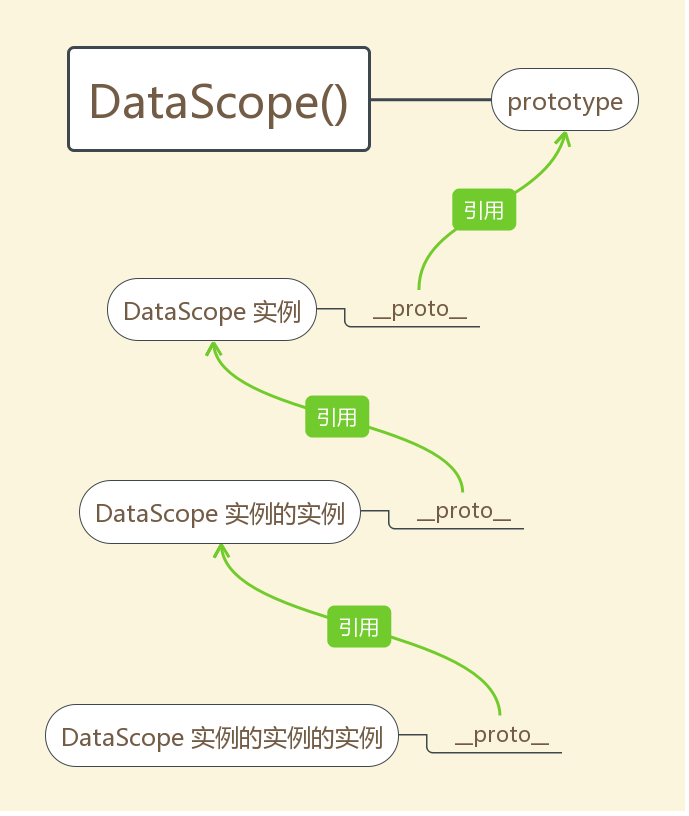
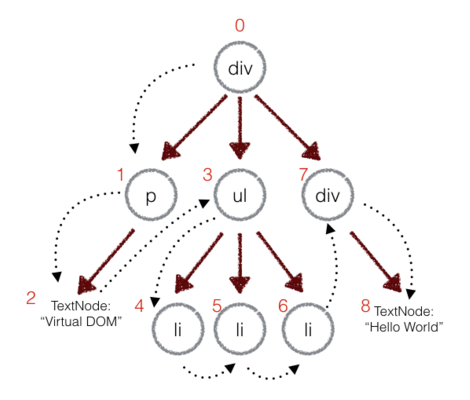

# 开源志愿者指南


## 核心架构







## 环境依赖

 1. [Git](https://git-scm.com/downloads)

 2. [Google Chrome](http://www.google.cn/chrome/browser/desktop/) 60+

 3. [Node.JS](https://nodejs.org/zh-cn/download/) 7.6+


## 源码构建

UNIX-Shell、Windows-CMD 通用脚本 ——

```Shell
git clone https://git.oschina.net/Tech_Query/EasyWebApp.git

npm install

npm run build

npm test    # or `npm run debug`
```
